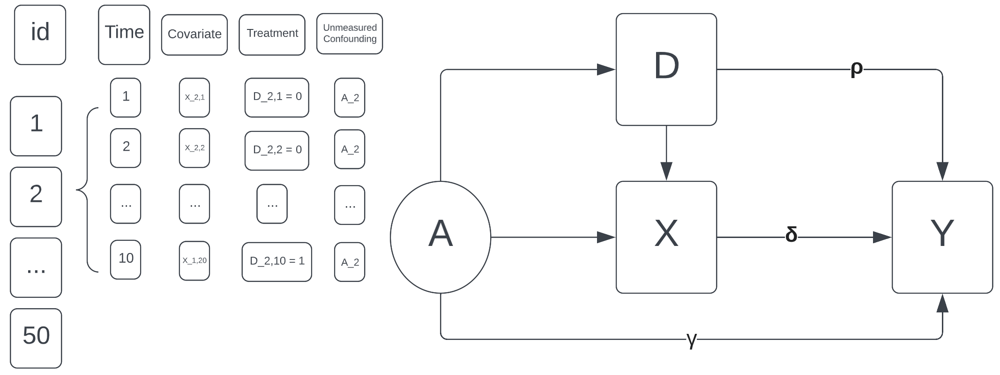

```{r setup, include=FALSE}
knitr::opts_chunk$set(echo = F, cache = F, warning = F, message = F)
library(tidyverse)
library(lme4)
library(ggplot2)
library(gridExtra)
library(kableExtra)
library(GGally)
ggplot2::theme_set(ggplot2::theme_bw())
knitr::opts_chunk$set(fig.align = 'center')
knitr::opts_chunk$set(fig.pos = "H")

load("bias_result_full.RData")
bias_result_full$confound_treatment = factor(bias_result_full$confound_treatment)
levels(bias_result_full$confound_treatment)[levels(bias_result_full$confound_treatment)=="Uniform"] <- "Very Strong"
```


\section{Introduction}

Panel data analysis is a widely used statistical tool in social sciences, econometrics and ecology to study the relationships between variables over time. However, this type of analysis is susceptible to confounding variables, which can bias the estimated coefficients and distort the interpretation of the results. 
Fixed and random effects models frequently emerge in panel data analysis to account for confounding variables that are time-invariant [@gunasekara2014fixed] or time-varying [@li2011nonpara; @ahn2013panel]. 
A common belief among econometricians is that fixed effects (FE) or random effects (RE) models can absorb unmeasured confounding variables [@angrist2009mostly], but the mechanism behind this claim is mysterious and not well-understood. 
In this research paper, we aim to explore the relationship between fixed/random effects and time-invariant unmeasured confounding in panel data analysis and provide insights into whether and in what sense these models can address this issue.


Based on the results of our simulations, we found that the implementation of fixed/random effects models can, to a certain extent, address the presence of unmeasured confoundings. However, there remains some systematic bias due to the correlations and interactions between the unmeasured confounding and the treatment assignment. Specifically, factors such as the size, time span and treatment time points of the panel data, the magnitude of the unmeasured confounding, and the extent to which it impacts both the treatment and the outcome all play important roles in influencing the degree of bias present in the causal estimations from fixed/random effects models.


\section{Background}

In typical observational studies, failing to capture significant unmeasured confounding gives rise to biased estimates of treatment effects, which compels practitioners to develop methods of assessing and handling uncontrolled confounding [@vanderweele2011unmeasured]. 
The question of whether fixed/random effects models can account for unmeasured confounding in panel data analysis has been the subject of much debate particuarly in the econometrics literature. 
A number of studies have explored this issue from different angles and with varying degrees of empirical evidence.

One line of research has focused on theoretical arguments for why fixed/random effects models might be effective at absorbing unmeasured confounding. 
For example, @angrist2009mostly discuss the strategies that use data with a time or cohort dimension to control for unobserved-but-fixed omitted variables.
@hausman1981panel argue that fixed effects models can control for the time-invariant confounders by essentially differencing them out, while random effects models can account for time-varying confounders that are uncorrelated with the fixed effects. More recently, @wooldridge2010econometric has suggested that fixed effects models can be viewed as a form of quasi-experimental design that mimics a randomized controlled trial, and thus can address the unobserved component to the extent that such designs do.

Other scholars have openly challenged the notion that fixed/random effects models can fully absorbing unmeasured confounding. For example, @mundlak1978pooling once argued that random effects models are biased when unobserved heterogeneity is correlated with observed variables, and that fixed effects models are limited by the fact that they cannot correctly estimate time-invariant confoundings. 
@hazlett2022understanding point out that random effect estimates in multilevel models are equivalent to fixed effects estimates that have been shrunken through a regularization process. When the source of unmeasured confounding is at the group-level, the FE approach could unbiasedly estimates treatment effects, but with poor estimates of standard errors. Bias takes place in random effects models because their variables are not “allowed” to adjust for confounding as intended and thus fails to remove the unmeasured confounding.
Furthermore, @bell2015explaining note that while fixed effects models can provide reasonable estimates of treatment effects, they may still suffer from omitted variable bias if the unobserved confounding variable is correlated with the time-varying variables.

Therefore, the effectiveness of fixed/random effects models in accounting for unmeasured confounding and obtaining unbiased estimates of treatment effects in panel data analysis remains a topic of ongoing research and debate.
As such, our projects seeks to explore the trends of potential bias when applying fixed/random effects models in the events of unmeasured confounding.


\section{Method}

In this project, we investigate our research inquiry through a simulation study, with the aim of demonstrating the degree to which the fixed/random effects models estimate causal effects that align with the truth. Moreover, we also seek to identify any contributing factors that could potentially impact the magnitude of bias in these estimations.

```{r DAG, fig.cap="\\label{fig:causal_DAG} Visualize the problem of unmeasured confoudning using a causal DAG",out.width="50%"}

```

While many previous work presume that specifying an intercept for every individual in the study (using either FE or RE model) is an appropriate method to address any unmeasured confoundings, the proposed methods either have strict assumptions or do not seem to take into account of the relationship and possible interactions between the unmeasured confounding and the treatment.


\subsection{Continuous Case}

In the case of continous outcomes, our data generation process (DGP) uses the following specifications:
<!-- E\left(\mathrm{Y}_{i t} \mid A_i, \mathrm{X}_{i t}, t, \mathrm{D}_{i t}\right)& =\alpha+\lambda_t+\rho \mathrm{D}_{i t}+ \gamma A_i+ \delta \mathrm{X}_{i t} \\ -->
$$
\begin{aligned}
Y_{it} &= \alpha+\lambda_t+ \delta \mathrm{X}_{i t}+\rho \mathrm{D}_{i t}+ \gamma A_i+\phi \mathrm{D}_{i t} A_i +\epsilon_{it} \\
\end{aligned}
$$

In our most basic DGP of artificial panel data, there are $N = 100$ individuals and $T = 10$ time points. Usually at half time ($\frac{T}{2}$), treatment is given to those in the treatment group. Covariate, $X$, for each individual is simulated from $N(0,1)$. The unmeasured counfounding, $A$, is either from $N(0,1)$ or $\text{Uniform(0,1)}$. Notice that $A$ is a latent and time-invariant trait that is unobservable during modeling fitting.  

We designed two ways that the unmeasured confounding, A, could affect the treatment assignment: First, as $A\sim N(0,1)$ is above or below a certain cut-off point, the probability of receiving the treatment changes to respective values. This is controllable since we can adjust the respective values to be widely apart (`strong` influence of A on D) or to be close (`small` influence of A on D).
Second, $A\sim \text{Uniform}(0,1)$ directly serves as the probability of receiving the treatment. We regard this as `very strong` influence of A on D.  

In addition, we also considered the potential interaction effects from unmeasured confounding and treatment on the outcome. There are three specifications of the interaction term: (1) $\phi A_i D_{it}$, (2) $\phi A_i^2 D_{it}$ and (3) $\phi \frac{ 1}{A_i}D_{it}$, which cover the identity, square and inverse transformation of unmeasured confounding. 

The outcome variable, $Y_{it}$, is thus continuous and generated from a linear model including: 

* The true coefficient for covariate, $\delta$, is chosen arbitrarily as 1 or 5. 

* The true treatment effect, i.e. the coefficient of treatment status, $\rho$, could vary from to 1 to 20.

* The true coefficient of unmeasured confounding, $\gamma$, could vary from to 0 to 20, with zero meaning that there is no direct effect of unmeasured confounding on the outcome. 

* The true coefficient of the interaction, $\phi$, between the treatment and the unmeasured confounding could vary from to 0 to 10, with zero meaning that there is no interaction effect. 

* The noise term, $\epsilon_{it}$, is set to follow $\epsilon_{it} \overset{i.i.d}\sim N(0,1)$. 


**Estimators**

There are several distinct methods that allow for estimations of treatment effects. Our primary objective is to assess the performance of these models under a range of diverse circumstances.

\ 

***Difference-in-difference (DID) estimator***: The Difference-in-Differences (DID) method is a quasi-experimental approach used to estimate the causal effect of a treatment in panel data. Its formulation could be viewed using the difference between the "Before-after (BA)" estimators of treatment and of control groups, which makes it easier and faster to calculate than regression-based models. Nevertheless, adding time-varying covariates and interaction terms are easier to do in parametric models rather than DID.  

$$
\begin{aligned}
\tau^{DID} &= (\bar Y_{1, t+1} - \bar Y_{1, t}) - (\bar Y_{0, t+1} - \bar Y_{0, t}) =\hat\tau^{BA}_1-\hat\tau^{BA}_0
\end{aligned}
$$


***OLS model***: The basic form of OLS model is very likely to be vulnerable to severe bias since it does not remedy unmeasured confounding or potential interactions. 

$$
\begin{aligned}
Y_{it} &= \alpha+\lambda_t+\rho \mathrm{D}_{i t}+ \delta \mathrm{X}_{i t}+ \epsilon_{it} 
\end{aligned}
$$


***Fixed effects (FE) model***: The formulation and validity of the fixed effects model are discussed extensively in the literature. Despite that, whether the individual intercepts can fully absorb all types of unmeasured confoundings remains questionable.   

$$
\begin{aligned}
\alpha_i &\equiv \alpha+ \gamma A_i\\
Y_{it} &= \alpha_i+\lambda_t+\rho \mathrm{D}_{i t}+ \delta \mathrm{X}_{i t}+ \epsilon_{it} 
\end{aligned}
$$


***Random effects (RE/RI) model***: The random effects model is essentially a random intercept (RI) model. The argument that RI could account for unmeasured confounding is theoretically problematic due to its modeling specification. 
In particular, bias emerges when the random effects are correlated with the treatment. Because the group-specific intercepts in a RI model are regularized, they do not achieve the values that would “fully absorb” group-specific confounding, leaving components unexplained that can instead be captured by FE [@hazlett2022understanding]. 

$$
\begin{aligned}
Y_{it} &= \alpha_i+\lambda_t+\rho \mathrm{D}_{i t}+ \delta \mathrm{X}_{i t}+ \epsilon_{it} \\
& \text{where } \alpha_i | D, X \overset{i.i.d}\sim N(\mu, \sigma^2)
\end{aligned}
$$

We use `lmer` from the `lme4` package to fit the random intercept model using REML. The frequentiest way of fitting random intercept models is often used and faster to compute, though it may not have as robust uncertainty quantification as the Bayesian hierarchical models.  

\subsection{Binary Case}

FE: logit(Y) = ...

RE: `glmer` from the `lme4`


\section{Result}

In Figure \ref{fig:bias_with_ols}, we show that 


Figure \ref{fig:bias_without_ols}

Figure \ref{fig:bias_with_t}

Figure \ref{fig:bias_with_t_treat}

Figure \ref{fig:bias_with_gamma}

Figure \ref{fig:bias_with_rho}

In Figure \ref{fig:bias_interaction}, we illustrate that having an interaction term between unmeasured confounding and treatment assignment 


\section{Discussion}


Limitation and further direction: 

Time-variant confounding? 

More time points?

Estimated coefficients of latent variable?


Overall, our project and many literature suggest that while fixed/random effects models may be useful in controlling for unmeasured confounding in panel data analysis, they are not a panacea. Other methods, such as instrumental variables or regression discontinuity designs, may be more necessary in certain cases to fully address this issue.


\newpage


\section{Appendix}

```{r With OLS, fig.cap="\\label{fig:bias_with_ols} Average bias of estimated treatment effects from four types of estimation methods under N = 100, t = 10 and t-treat = 5, faceted by degree to which A affects D.",fig.height=6, fig.width=11, out.width="85%"}
gridExtra::grid.arrange(
bias_result_full %>% pivot_longer(cols = c("DID_bias","OLS_bias","FE_bias", "RE_bias"), names_to = "Bias_Type", values_to = "Bias") %>%
  filter(rho == 5) %>%
  ggplot(aes(x = gamma, y = Bias, color = Bias_Type)) + geom_point() + geom_line() + facet_wrap(~confound_treatment) + labs(x = expression(gamma))
,
bias_result_full %>% pivot_longer(cols = c("DID_bias","OLS_bias","FE_bias", "RE_bias"), names_to = "Bias_Type", values_to = "Bias") %>%
  filter(gamma == 5) %>%
  ggplot(aes(x = rho, y = Bias, color = Bias_Type)) + geom_point() + geom_line() + facet_wrap(~confound_treatment) + labs(x = expression(rho))
)
```

```{r Without OLS, fig.cap="\\label{fig:bias_without_ols} Compareing average bias of estimated treatment effects from DID, FE, and RE models under N = 100, t = 10 and t-treat = 5, faceted by degree to which A affects D.",fig.height=6, fig.width=11, out.width="85%"}
gridExtra::grid.arrange(
bias_result_full %>% pivot_longer(cols = c("DID_bias","OLS_bias","FE_bias", "RE_bias"), names_to = "Bias_Type", values_to = "Bias") %>%
  filter(Bias_Type != "OLS_bias", rho == 5) %>% 
  ggplot(aes(x = gamma, y = Bias, color = Bias_Type)) + geom_point() + geom_line() + facet_wrap(~confound_treatment) + labs(x = expression(gamma))
,
bias_result_full %>% pivot_longer(cols = c("DID_bias","OLS_bias","FE_bias", "RE_bias"), names_to = "Bias_Type", values_to = "Bias") %>%
  filter(Bias_Type != "OLS_bias", gamma == 5) %>%
  ggplot(aes(x = rho, y = Bias, color = Bias_Type)) + geom_point() + geom_line()  + facet_wrap(~confound_treatment) + labs(x = expression(rho))
)
```


```{r n_of_time, fig.cap="\\label{fig:bias_with_t} Distribution of bias across varying total time points. Starting from here and the following figures, N = 50 and all coeffiients are 1 unless specified otherwise.", fig.width=10, fig.height=3.5}
load("result_data/result_5_3_gamma1_phi0.RData")
load("result_data/result_10_5_gamma1_phi0.RData")
load("result_data/result_30_15_gamma1_phi0.RData")
load("result_data/result_50_25_gamma1_phi0.RData")
gridExtra::grid.arrange(
  result_5_3_gamma1_phi0 %>% as_tibble() %>%
  pivot_longer(cols = c("OLS_bias","FE_bias", "RE_bias"), names_to = "Model", values_to = "Bias")%>% 
  mutate(Model = factor(Model, levels = c("OLS_bias","FE_bias", "RE_bias"))) %>% 
  mutate(Model = recode(Model, OLS_bias = 'OLS',FE_bias = 'FE',RE_bias = 'RE'))%>% 
  ggplot() + geom_boxplot(aes(x = Model, y = Bias)) + ylim(-0.5,1) + geom_hline(yintercept=0, linetype="dashed",color = "RED") + labs(title = "T = 5, T-treat = 3"),
result_10_5_gamma1_phi0 %>% as_tibble() %>%
  pivot_longer(cols = c("OLS_bias","FE_bias", "RE_bias"), names_to = "Model", values_to = "Bias")%>% 
  mutate(Model = factor(Model, levels = c("OLS_bias","FE_bias", "RE_bias")))%>%
  mutate(Model = recode(Model, OLS_bias = 'OLS',FE_bias = 'FE',RE_bias = 'RE'))%>% 
  ggplot() + geom_boxplot(aes(x = Model, y = Bias)) + ylim(-0.5,1) + geom_hline(yintercept=0, linetype="dashed",color = "RED") + labs(title = "T = 10, T-treat = 5"), 
result_30_15_gamma1_phi0 %>% as_tibble() %>%
  pivot_longer(cols = c("OLS_bias","FE_bias", "RE_bias"), names_to = "Model", values_to = "Bias")%>% 
  mutate(Model = factor(Model, levels = c("OLS_bias","FE_bias", "RE_bias")))%>%
  mutate(Model = recode(Model, OLS_bias = 'OLS',FE_bias = 'FE',RE_bias = 'RE'))%>%  
  ggplot() + geom_boxplot(aes(x = Model, y = Bias)) + ylim(-0.5,1) + geom_hline(yintercept=0, linetype="dashed",color = "RED") + labs(title = "T = 30, T-treat = 15"), 
result_50_25_gamma1_phi0 %>% as_tibble() %>%
  pivot_longer(cols = c("OLS_bias","FE_bias", "RE_bias"), names_to = "Model", values_to = "Bias")%>% 
  mutate(Model = factor(Model, levels = c("OLS_bias","FE_bias", "RE_bias")))%>%
  mutate(Model = recode(Model, OLS_bias = 'OLS',FE_bias = 'FE',RE_bias = 'RE'))%>%  
  ggplot() + geom_boxplot(aes(x = Model, y = Bias)) + ylim(-0.5,1) + geom_hline(yintercept=0, linetype="dashed",color = "RED") + labs(title = "T = 50, T-treat = 25"),nrow = 1)
```


```{r n_of_time_treat, fig.cap="\\label{fig:bias_with_t_treat} Distribution of bias across varying treatment time points.", fig.width=10, fig.height=3.5}
load("result_data/result_20_3_gamma1_phi0.RData")
load("result_data/result_20_8_gamma1_phi0.RData")
load("result_data/result_20_13_gamma1_phi0.RData")
load("result_data/result_20_18_gamma1_phi0.RData")

gridExtra::grid.arrange(
  result_20_3_gamma1_phi0 %>% as_tibble() %>%
  pivot_longer(cols = c("OLS_bias","FE_bias", "RE_bias"), names_to = "Model", values_to = "Bias")%>% 
  mutate(Model = factor(Model))%>% 
  mutate(Model = factor(Model, levels = c("OLS_bias","FE_bias", "RE_bias")))%>%
    mutate(Model = recode(Model, OLS_bias = 'OLS',FE_bias = 'FE',RE_bias = 'RE'))%>%  
  ggplot() + geom_boxplot(aes(x = Model, y = Bias)) + ylim(-0.8,1) + geom_hline(yintercept=0, linetype="dashed",color = "RED") + labs(title = "T = 20, T-treat = 3"),
result_20_8_gamma1_phi0 %>% as_tibble() %>%
  pivot_longer(cols = c("OLS_bias","FE_bias", "RE_bias"), names_to = "Model", values_to = "Bias")%>% 
  mutate(Model = factor(Model))%>% 
  mutate(Model = factor(Model, levels = c("OLS_bias","FE_bias", "RE_bias")))%>%
  mutate(Model = recode(Model, OLS_bias = 'OLS',FE_bias = 'FE',RE_bias = 'RE'))%>% 
  ggplot() + geom_boxplot(aes(x = Model, y = Bias)) + ylim(-0.8,1) + geom_hline(yintercept=0, linetype="dashed",color = "RED") + labs(title = "T = 20, T-treat = 8"), 
result_20_13_gamma1_phi0 %>% as_tibble() %>%
  pivot_longer(cols = c("OLS_bias","FE_bias", "RE_bias"), names_to = "Model", values_to = "Bias")%>% 
  mutate(Model = factor(Model))%>% 
  mutate(Model = factor(Model, levels = c("OLS_bias","FE_bias", "RE_bias")))%>%
  mutate(Model = recode(Model, OLS_bias = 'OLS',FE_bias = 'FE',RE_bias = 'RE'))%>%  
  ggplot() + geom_boxplot(aes(x = Model, y = Bias)) + ylim(-0.8,1) + geom_hline(yintercept=0, linetype="dashed",color = "RED") + labs(title = "T = 20, T-treat = 13"), 
result_20_18_gamma1_phi0 %>% as_tibble() %>%
  pivot_longer(cols = c("OLS_bias","FE_bias", "RE_bias"), names_to = "Model", values_to = "Bias")%>% 
  mutate(Model = factor(Model))%>% 
  mutate(Model = factor(Model, levels = c("OLS_bias","FE_bias", "RE_bias")))%>%
  mutate(Model = recode(Model, OLS_bias = 'OLS',FE_bias = 'FE',RE_bias = 'RE'))%>% 
  ggplot() + geom_boxplot(aes(x = Model, y = Bias)) + ylim(-0.8,1) + geom_hline(yintercept=0, linetype="dashed",color = "RED") + labs(title = "T = 20, T-treat = 18"),nrow = 1)
```


```{r bias_gamma, fig.cap="\\label{fig:bias_with_gamma} Distribution of bias across unmeasured confounding coefficients", fig.width=10, fig.height=3.5}
load("result_data/result_10_5_gamma3_phi0.RData")
load("result_data/result_10_5_gamma5_phi0.RData")
load("result_data/result_10_5_gamma10_phi0.RData")
load("result_data/result_10_5_gamma15_phi0.RData")

gridExtra::grid.arrange(
  result_10_5_gamma3_phi0 %>% as_tibble() %>%
  pivot_longer(cols = c("OLS_bias","FE_bias", "RE_bias"), names_to = "Model", values_to = "Bias")%>% 
  mutate(Model = factor(Model))%>% 
  mutate(Model = factor(Model, levels = c("OLS_bias","FE_bias", "RE_bias")))%>% 
  mutate(Model = recode(Model, OLS_bias = 'OLS',FE_bias = 'FE',RE_bias = 'RE'))%>% 
  ggplot() + geom_boxplot(aes(x = Model, y = Bias)) + ylim(-0.6,4) + geom_hline(yintercept=0, linetype="dashed",color = "RED") + labs(title = expression(gamma~"= 3")),
result_10_5_gamma5_phi0 %>% as_tibble() %>%
  pivot_longer(cols = c("OLS_bias","FE_bias", "RE_bias"), names_to = "Model", values_to = "Bias")%>% 
  mutate(Model = factor(Model))%>% 
  mutate(Model = factor(Model, levels = c("OLS_bias","FE_bias", "RE_bias")))%>%
  mutate(Model = recode(Model, OLS_bias = 'OLS',FE_bias = 'FE',RE_bias = 'RE'))%>% 
  ggplot() + geom_boxplot(aes(x = Model, y = Bias)) + ylim(-0.6,4) + geom_hline(yintercept=0, linetype="dashed",color = "RED") + labs(title = expression(gamma~"= 5")),
result_10_5_gamma10_phi0 %>% as_tibble() %>%
  pivot_longer(cols = c("OLS_bias","FE_bias", "RE_bias"), names_to = "Model", values_to = "Bias")%>% 
  mutate(Model = factor(Model))%>% 
  mutate(Model = factor(Model, levels = c("OLS_bias","FE_bias", "RE_bias")))%>%
  mutate(Model = recode(Model, OLS_bias = 'OLS',FE_bias = 'FE',RE_bias = 'RE'))%>%  
  ggplot() + geom_boxplot(aes(x = Model, y = Bias)) + ylim(-0.6,4) + geom_hline(yintercept=0, linetype="dashed",color = "RED") + labs(title = expression(gamma~"= 10")),
result_10_5_gamma15_phi0 %>% as_tibble() %>%
  pivot_longer(cols = c("OLS_bias","FE_bias", "RE_bias"), names_to = "Model", values_to = "Bias")%>% 
  mutate(Model = factor(Model))%>% 
  mutate(Model = factor(Model, levels = c("OLS_bias","FE_bias", "RE_bias")))%>%
  mutate(Model = recode(Model, OLS_bias = 'OLS',FE_bias = 'FE',RE_bias = 'RE'))%>%  
  ggplot() + geom_boxplot(aes(x = Model, y = Bias)) + ylim(-0.6,4) + geom_hline(yintercept=0, linetype="dashed",color = "RED") + labs(title = expression(gamma~"= 15")),nrow = 1)


# gridExtra::grid.arrange(
#   result_10_5_gamma3_phi0 %>% as_tibble() %>%
#   pivot_longer(cols = c("FE_bias", "RE_bias"), names_to = "Model", values_to = "Bias")%>% 
#   mutate(Model = factor(Model))%>% 
#   mutate(Model = factor(Model, levels = c("FE_bias", "RE_bias")))%>% 
#   ggplot() + geom_boxplot(aes(x = Model, y = Bias)) + ylim(-0.6,1) + geom_hline(yintercept=0, linetype="dashed",color = "RED") + labs(title = expression(gamma~"= 3")),
# result_10_5_gamma5_phi0 %>% as_tibble() %>%
#   pivot_longer(cols = c("FE_bias", "RE_bias"), names_to = "Model", values_to = "Bias")%>% 
#   mutate(Model = factor(Model))%>% 
#   mutate(Model = factor(Model, levels = c("FE_bias", "RE_bias")))%>%
#   ggplot() + geom_boxplot(aes(x = Model, y = Bias)) + ylim(-0.6,1) + geom_hline(yintercept=0, linetype="dashed",color = "RED") + labs(title = expression(gamma~"= 5")),
# result_10_5_gamma10_phi0 %>% as_tibble() %>%
#   pivot_longer(cols = c("FE_bias", "RE_bias"), names_to = "Model", values_to = "Bias")%>% 
#   mutate(Model = factor(Model))%>% 
#   mutate(Model = factor(Model, levels = c("FE_bias", "RE_bias")))%>%
#   ggplot() + geom_boxplot(aes(x = Model, y = Bias)) + ylim(-0.6,1) + geom_hline(yintercept=0, linetype="dashed",color = "RED") + labs(title = expression(gamma~"= 10")),
# result_10_5_gamma15_phi0 %>% as_tibble() %>%
#   pivot_longer(cols = c("FE_bias", "RE_bias"), names_to = "Model", values_to = "Bias")%>% 
#   mutate(Model = factor(Model))%>% 
#   mutate(Model = factor(Model, levels = c("FE_bias", "RE_bias")))%>%
#   ggplot() + geom_boxplot(aes(x = Model, y = Bias)) + ylim(-0.6,1) + geom_hline(yintercept=0, linetype="dashed",color = "RED") + labs(title = expression(gamma~"= 15")),nrow = 1)
```


```{r bias_rho, fig.cap="\\label{fig:bias_with_rho} Distribution of bias across true causal effects", fig.width=10, fig.height=3.5, out.width="88%"}
load("result_data/result_10_5_gamma1_rho1.RData")
load("result_data/result_10_5_gamma1_rho3.RData")
load("result_data/result_10_5_gamma1_rho5.RData")
load("result_data/result_10_5_gamma1_rho7.RData")

gridExtra::grid.arrange(
  result_10_5_gamma1_rho1 %>% as_tibble() %>%
  pivot_longer(cols = c("OLS_bias","FE_bias", "RE_bias"), names_to = "Model", values_to = "Bias")%>% 
  mutate(Model = factor(Model))%>% 
  mutate(Model = factor(Model, levels = c("OLS_bias","FE_bias", "RE_bias")))%>%
    mutate(Model = recode(Model, OLS_bias = 'OLS',FE_bias = 'FE',RE_bias = 'RE'))%>%  
  ggplot() + geom_boxplot(aes(x = Model, y = Bias)) + ylim(-.7,1) + geom_hline(yintercept=0, linetype="dashed",color = "RED") + labs(title = expression(rho~"= 1")),
result_10_5_gamma1_rho3 %>% as_tibble() %>%
  pivot_longer(cols = c("OLS_bias","FE_bias", "RE_bias"), names_to = "Model", values_to = "Bias")%>% 
  mutate(Model = factor(Model))%>% 
  mutate(Model = factor(Model, levels = c("OLS_bias","FE_bias", "RE_bias")))%>%
  mutate(Model = recode(Model, OLS_bias = 'OLS',FE_bias = 'FE',RE_bias = 'RE'))%>% 
  ggplot() + geom_boxplot(aes(x = Model, y = Bias)) + ylim(-.7,1) + geom_hline(yintercept=0, linetype="dashed",color = "RED") + labs(title = expression(rho~"= 3")),
result_10_5_gamma1_rho5 %>% as_tibble() %>%
  pivot_longer(cols = c("OLS_bias","FE_bias", "RE_bias"), names_to = "Model", values_to = "Bias")%>% 
  mutate(Model = factor(Model))%>% 
  mutate(Model = factor(Model, levels = c("OLS_bias","FE_bias", "RE_bias")))%>%
  mutate(Model = recode(Model, OLS_bias = 'OLS',FE_bias = 'FE',RE_bias = 'RE'))%>% 
  ggplot() + geom_boxplot(aes(x = Model, y = Bias)) + ylim(-.7,1) + geom_hline(yintercept=0, linetype="dashed",color = "RED") + labs(title = expression(rho~"= 5")),
result_10_5_gamma1_rho7 %>% as_tibble() %>%
  pivot_longer(cols = c("OLS_bias","FE_bias", "RE_bias"), names_to = "Model", values_to = "Bias")%>% 
  mutate(Model = factor(Model))%>% 
  mutate(Model = factor(Model, levels = c("OLS_bias","FE_bias", "RE_bias")))%>%
  mutate(Model = recode(Model, OLS_bias = 'OLS',FE_bias = 'FE',RE_bias = 'RE'))%>% 
  ggplot() + geom_boxplot(aes(x = Model, y = Bias)) + ylim(-.7,1) + geom_hline(yintercept=0, linetype="dashed",color = "RED") + labs(title = expression(rho~"= 7")), nrow = 1)
```


```{r bias_interaction, fig.cap="\\label{fig:bias_interaction} Distribution of bias across coefficients of interactions", fig.width=10, fig.height=9, out.width="98%"}
load("result_data/result_5_3_gamma3_phi0.RData")
load("result_data/result_5_3_gamma3_phi1.RData")
load("result_data/result_5_3_gamma3_phi3.RData")
load("result_data/result_5_3_gamma3_phi5.RData")

load("result_data/result_5_3_gamma3_phi0sq.RData")
load("result_data/result_5_3_gamma3_phi1sq.RData")
load("result_data/result_5_3_gamma3_phi3sq.RData")
load("result_data/result_5_3_gamma3_phi5sq.RData")

load("result_data/result_5_3_gamma3_phi0inv.RData")
load("result_data/result_5_3_gamma3_phi1inv.RData")
load("result_data/result_5_3_gamma3_phi3inv.RData")
load("result_data/result_5_3_gamma3_phi5inv.RData")

gridExtra::grid.arrange(
 result_5_3_gamma3_phi0inv %>% as_tibble() %>%
  pivot_longer(cols = c("OLS_bias","FE_bias", "RE_bias"), names_to = "Model", values_to = "Bias")%>% 
  mutate(Model = factor(Model))%>% 
  mutate(Model = factor(Model, levels = c("OLS_bias","FE_bias", "RE_bias")))%>%
  mutate(Model = recode(Model, OLS_bias = 'OLS',FE_bias = 'FE',RE_bias = 'RE'))%>% 
  ggplot() + geom_boxplot(aes(x = Model, y = Bias))+ ylim(-0.5,5) + geom_hline(yintercept=0, linetype="dashed",color = "RED") + labs(title = expression(phi~"=0, Interaction: 1/A*D")),
result_5_3_gamma3_phi1inv %>% as_tibble() %>%
  pivot_longer(cols = c("OLS_bias","FE_bias", "RE_bias"), names_to = "Model", values_to = "Bias")%>% 
  mutate(Model = factor(Model))%>% 
  mutate(Model = factor(Model, levels = c("OLS_bias","FE_bias", "RE_bias")))%>%
  mutate(Model = recode(Model, OLS_bias = 'OLS',FE_bias = 'FE',RE_bias = 'RE'))%>% 
  ggplot() + geom_boxplot(aes(x = Model, y = Bias))+ ylim(-0.5,10) + geom_hline(yintercept=0, linetype="dashed",color = "RED") + labs(title = expression(phi~"=1, Interaction: 1/A*D")),
result_5_3_gamma3_phi3inv %>% as_tibble() %>%
  pivot_longer(cols = c("OLS_bias","FE_bias", "RE_bias"), names_to = "Model", values_to = "Bias")%>% 
  mutate(Model = factor(Model))%>% 
  mutate(Model = factor(Model, levels = c("OLS_bias","FE_bias", "RE_bias")))%>%
  mutate(Model = recode(Model, OLS_bias = 'OLS',FE_bias = 'FE',RE_bias = 'RE'))%>% 
  ggplot() + geom_boxplot(aes(x = Model, y = Bias))+ ylim(-0.5,10) + geom_hline(yintercept=0, linetype="dashed",color = "RED") + labs(title = expression(phi~"=3, Interaction: 1/A*D")),
result_5_3_gamma3_phi5inv %>% as_tibble() %>%
  pivot_longer(cols = c("OLS_bias","FE_bias", "RE_bias"), names_to = "Model", values_to = "Bias")%>% 
  mutate(Model = factor(Model))%>% 
  mutate(Model = factor(Model, levels = c("OLS_bias","FE_bias", "RE_bias")))%>% 
  mutate(Model = recode(Model, OLS_bias = 'OLS',FE_bias = 'FE',RE_bias = 'RE'))%>% 
  ggplot() + geom_boxplot(aes(x = Model, y = Bias))+ ylim(-0.5,10) + geom_hline(yintercept=0, linetype="dashed",color = "RED") + labs(title = expression(phi~"=5, Interaction: 1/A*D")),

 result_5_3_gamma3_phi0 %>% as_tibble() %>%
  pivot_longer(cols = c("OLS_bias","FE_bias", "RE_bias"), names_to = "Model", values_to = "Bias")%>% 
  mutate(Model = factor(Model))%>% 
  mutate(Model = factor(Model, levels = c("OLS_bias","FE_bias", "RE_bias")))%>%
   mutate(Model = recode(Model, OLS_bias = 'OLS',FE_bias = 'FE',RE_bias = 'RE'))%>% 
  ggplot() + geom_boxplot(aes(x = Model, y = Bias))+ ylim(-0.5,5) + geom_hline(yintercept=0, linetype="dashed",color = "RED") + labs(title = expression(phi~"=0, Interaction: A*D")),
result_5_3_gamma3_phi1 %>% as_tibble() %>%
  pivot_longer(cols = c("OLS_bias","FE_bias", "RE_bias"), names_to = "Model", values_to = "Bias")%>% 
  mutate(Model = factor(Model))%>% 
  mutate(Model = factor(Model, levels = c("OLS_bias","FE_bias", "RE_bias")))%>%
  mutate(Model = recode(Model, OLS_bias = 'OLS',FE_bias = 'FE',RE_bias = 'RE'))%>% 
  ggplot() + geom_boxplot(aes(x = Model, y = Bias))+ ylim(-0.5,5) + geom_hline(yintercept=0, linetype="dashed",color = "RED") + labs(title = expression(phi~"=1, Interaction: A*D")),
result_5_3_gamma3_phi3 %>% as_tibble() %>%
  pivot_longer(cols = c("OLS_bias","FE_bias", "RE_bias"), names_to = "Model", values_to = "Bias")%>% 
  mutate(Model = factor(Model))%>% 
  mutate(Model = factor(Model, levels = c("OLS_bias","FE_bias", "RE_bias")))%>%
  mutate(Model = recode(Model, OLS_bias = 'OLS',FE_bias = 'FE',RE_bias = 'RE'))%>% 
  ggplot() + geom_boxplot(aes(x = Model, y = Bias))+ ylim(-0.5,5) + geom_hline(yintercept=0, linetype="dashed",color = "RED") + labs(title = expression(phi~"=3, Interaction: A*D")),
result_5_3_gamma3_phi5 %>% as_tibble() %>%
  pivot_longer(cols = c("OLS_bias","FE_bias", "RE_bias"), names_to = "Model", values_to = "Bias")%>% 
  mutate(Model = factor(Model))%>% 
  mutate(Model = factor(Model, levels = c("OLS_bias","FE_bias", "RE_bias")))%>%
  mutate(Model = recode(Model, OLS_bias = 'OLS',FE_bias = 'FE',RE_bias = 'RE'))%>% 
  ggplot() + geom_boxplot(aes(x = Model, y = Bias))+ ylim(-0.5,5) + geom_hline(yintercept=0, linetype="dashed",color = "RED") + labs(title = expression(phi~"=5, Interaction: A*D")),
 result_5_3_gamma3_phi0sq %>% as_tibble() %>%
  pivot_longer(cols = c("OLS_bias","FE_bias", "RE_bias"), names_to = "Model", values_to = "Bias")%>% 
  mutate(Model = factor(Model))%>% 
  mutate(Model = factor(Model, levels = c("OLS_bias","FE_bias", "RE_bias")))%>%
  mutate(Model = recode(Model, OLS_bias = 'OLS',FE_bias = 'FE',RE_bias = 'RE'))%>% 
  ggplot() + geom_boxplot(aes(x = Model, y = Bias))+ ylim(-0.5,5) + geom_hline(yintercept=0, linetype="dashed",color = "RED") + labs(title = expression(phi~"=0, Interaction: A^2*D")),
result_5_3_gamma3_phi1sq %>% as_tibble() %>%
  pivot_longer(cols = c("OLS_bias","FE_bias", "RE_bias"), names_to = "Model", values_to = "Bias")%>% 
  mutate(Model = factor(Model))%>% 
  mutate(Model = factor(Model, levels = c("OLS_bias","FE_bias", "RE_bias")))%>%
  mutate(Model = recode(Model, OLS_bias = 'OLS',FE_bias = 'FE',RE_bias = 'RE'))%>%  
  ggplot() + geom_boxplot(aes(x = Model, y = Bias))+ ylim(-0.5,5) + geom_hline(yintercept=0, linetype="dashed",color = "RED") + labs(title = expression(phi~"=1, Interaction: A^2*D")),
result_5_3_gamma3_phi3sq %>% as_tibble() %>%
  pivot_longer(cols = c("OLS_bias","FE_bias", "RE_bias"), names_to = "Model", values_to = "Bias")%>% 
  mutate(Model = factor(Model))%>% 
  mutate(Model = factor(Model, levels = c("OLS_bias","FE_bias", "RE_bias")))%>%
  mutate(Model = recode(Model, OLS_bias = 'OLS',FE_bias = 'FE',RE_bias = 'RE'))%>% 
  ggplot() + geom_boxplot(aes(x = Model, y = Bias))+ ylim(-0.5,5) + geom_hline(yintercept=0, linetype="dashed",color = "RED") + labs(title = expression(phi~"=3, Interaction: A^2*D")),
result_5_3_gamma3_phi5sq %>% as_tibble() %>%
  pivot_longer(cols = c("OLS_bias","FE_bias", "RE_bias"), names_to = "Model", values_to = "Bias")%>% 
  mutate(Model = factor(Model))%>% 
  mutate(Model = factor(Model, levels = c("OLS_bias","FE_bias", "RE_bias")))%>%
  mutate(Model = recode(Model, OLS_bias = 'OLS',FE_bias = 'FE',RE_bias = 'RE'))%>% 
  ggplot() + geom_boxplot(aes(x = Model, y = Bias))+ ylim(-0.5,5) + geom_hline(yintercept=0, linetype="dashed",color = "RED") + labs(title = expression(phi~"=5, Interaction: A^2*D")), nrow = 3)
```


\newpage

\section{Reference}

